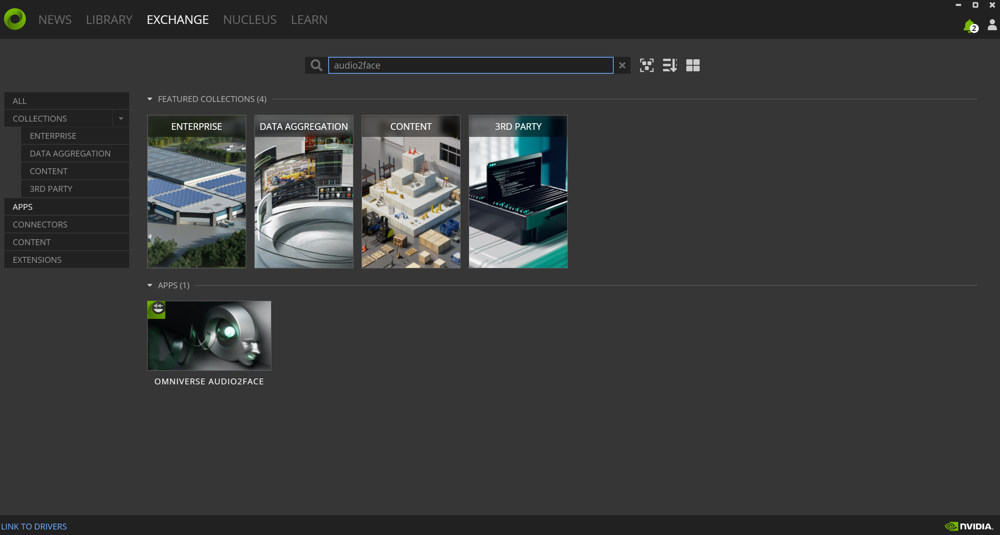
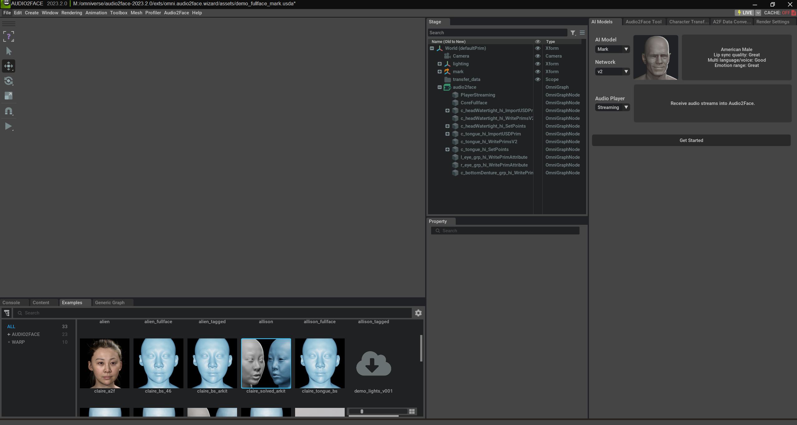
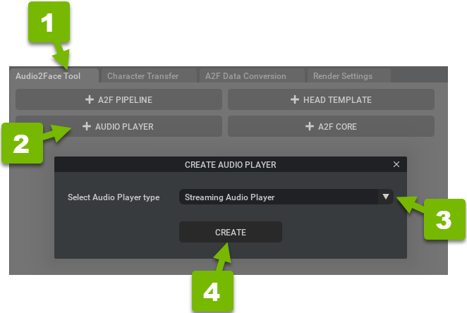
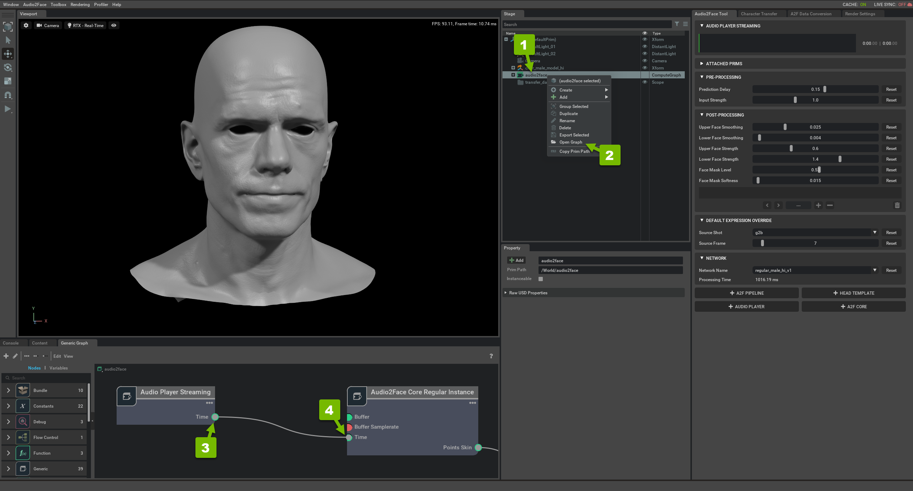
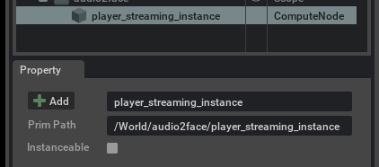

# Omniverse and Audio2Face

**NVIDIA Omniverse** is a powerful, multi-GPU, real-time simulation and collaboration platform that transforms workflows for design, animation, and simulation. Omniverse aims to empower creators, designers, and engineers to collaboratively build virtual worlds that were not previously possible. The platform is built on USD (Universal Scene Description), which allows for seamless and consistent sharing of data and workflows across multiple applications and users.

**Audio2Face** is an application within the Omniverse ecosystem that simplifies the process of animating a 3D character’s face by using just an audio track. This technology uses deep learning to automatically generate expressive facial animations that are synchronized with the voice, making it a valuable tool for creators in animation and game development.

## Installation
1. Download [Omniverse](https://www.nvidia.com/zh-tw/omniverse/download/) from the official website and install it.
2. Click on `EXCHANGE`, search for Audio2Face.

3. Click Download
4. Open Audio2Face
5. Select the example with `solved_arkit`.

6. Select the audio2face Tool, scroll down to the bottom, and select `+Audio Player` to create a player manually.

7. View the Graph. After creating a streaming audio player, connect its time attribute to the Audio2Face Core instance’s time attribute.

8. Click on player_streaming_instance and remember the Prim Path.

    
9. Test it. The code is located at  
`AUDIO2FACE_ROOT_PATH/exts/omni.audio2face.player/omni/audio2face/player/scripts/streaming_server/test_client.py`
